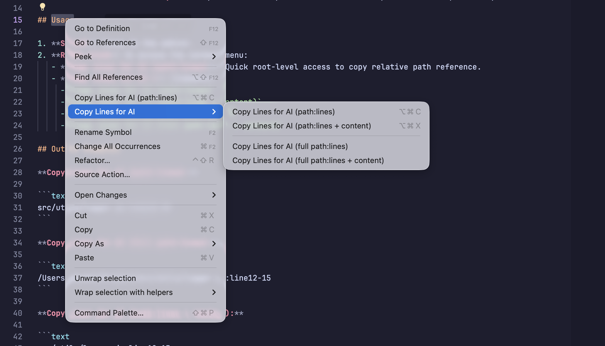

# Copy Lines for AI

Quickly copy selected code with its **file path + line range**. Perfect for pasting into AI chat windows (Claude, ChatGPT, Antigravity, Cursor, etc).



## Features

- **Relative Paths**: Automatically uses paths relative to your workspace root.
- **Full Paths**: Option to copy the absolute system path.
- **Line Ranges**: Includes current line number or range (e.g., `line10` or `line10-15`).
- **Markdown Formatting**: Wraps code in triple backticks with automatic language detection.
- **Forward Slash Consistency**: Always uses `/` in paths for better cross-platform/AI compatibility.

## Installation

### VS Code Marketplace (Coming Soon!)
Search for "Copy Lines for AI" in the VS Code Extensions view.

### Manual Installation (.vsix)
If you've downloaded the `.vsix` file from the [GitHub Releases](https://github.com/mdobydullah/copy-lines-for-ai/releases) page:
1. Open VS Code.
2. Go to the **Extensions** view (`Cmd+Shift+X`).
3. Click the **...** (Views and More Actions) menu in the top right.
4. Select **Install from VSIX...** and pick the downloaded file.

## Usage

1. **Select** lines in the editor.
2. **Right-click** to access the context menu:
   - **Copy Lines for AI (path:lines)**: Quick root-level access to copy relative path reference.
   - **Copy Lines for AI >** (Submenu):
     - `Copy Lines for AI (path:lines)`
     - `Copy Lines for AI (path:lines + content)`
     - `Copy Lines for AI (full path:lines)`
     - `Copy Lines for AI (full path:lines + content)`

## Output Examples

**Copy Lines for AI (path:lines):**

```text
src/utils/logger.js:line12-15
```

**Copy Lines for AI (full path:lines):**

```text
/Users/obydul/Project/src/utils/logger.js:line12-15
```

**Copy Lines for AI (path:lines + content):**

```text
src/utils/logger.js:line12-15
```js
function log(msg) {
  console.log(msg);
}
``
```

**Copy Lines for AI (full path:lines + content):**

```text
/Users/obydul/Project/src/utils/logger.js:line12-15
```js
function log(msg) {
  console.log(msg);
}
``
```

## Keyboard Shortcuts

| Action | Windows/Linux | Mac |
|--------|--------------|-----|
| Copy path:lines | `Ctrl+Alt+C` | `Cmd+Opt+C` |
| Copy path:lines + content | `Ctrl+Alt+X` | `Cmd+Opt+X` |

> [!TIP]
> You can easily change these shortcuts by going to **File > Preferences > Keyboard Shortcuts** and searching for "Copy Lines for AI".

## Settings

| Setting | Default | Description |
|---------|---------|-------------|
| `copyLinesForAI.useRelativePath` | `true` | Use relative path from workspace root |
| `copyLinesForAI.includeLanguageHint` | `true` | Add language tag to code block (e.g., ` ```javascript `) |

## License

MIT